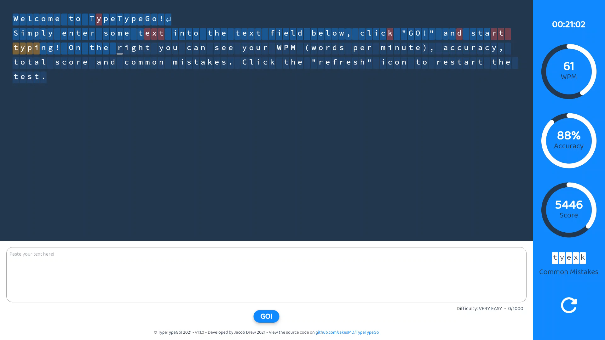

#  TypeTypeGo! - [typetypego.jakesmd.com](https://typetypego.jakesmd.com)

### 📄 Discription
- A web app that tests your typing skills with your own text.
- It calcuates your WPM, accuracy and total score
    - **WPM (words per minute):** (charactersTyped / 5) / minutesElapsed
    - **Accuracy:** (correctlyTypedCharacters / charactersTyped)*100
    - **Score:** WPM * Accuracy
- It shows common mistakes you make
---
### ℹ️ About
- Developed in dart with [flutter](https://flutter.dev)
- Just a fun project
---
### ❕ Please Note
- This has only been tested in Google Chrome, so it may not work in other browsers.
- Please open an issue [here](https://github.com/JakesMD/TypeTypeGo/issues) if you find a bug or something's not working for you.
- Feel free to contribute or request cool new features.
